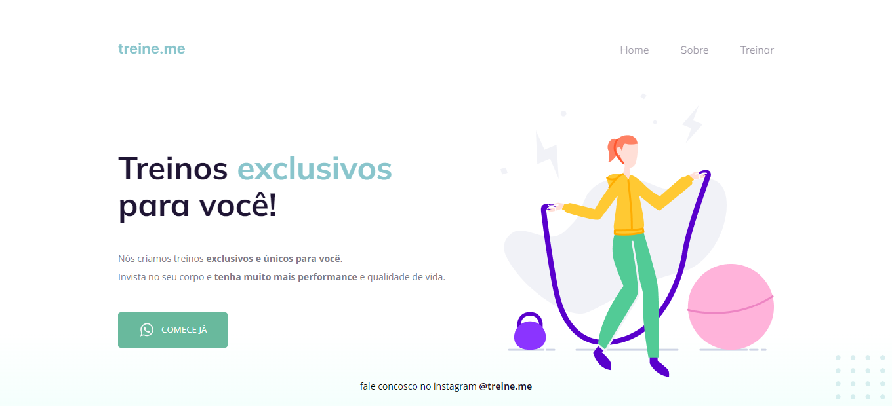

<h1 align="center">Projeto: Treine.me
</h1>

Projeto 02 - explorer stag 2

  <a href="#-tecnologias">Tecnologias</a>&nbsp;&nbsp;&nbsp;|&nbsp;&nbsp;&nbsp;
  <a href="#-projeto">Projeto</a>&nbsp;&nbsp;&nbsp;|&nbsp;&nbsp;&nbsp;
  <a href="#-como-executar">Como executar</a>&nbsp;&nbsp;&nbsp;|&nbsp;&nbsp;&nbsp;
  <a href="#memo-licença">Licença</a>

  

 

  

## 🚀 Tecnologias

Esse projeto foi desenvolvido com as seguintes tecnologias:

- HTML e CSS

## 💻 Projeto

O "Treine.me" é uma plataforma digital dedicada a fornecer treinos exclusivos e personalizados para seus usuários, visando melhorar a performance física e a qualidade de vida. Através de uma interface amigável e moderna, os usuários podem facilmente acessar informações sobre os treinos e entrar em contato para iniciar suas atividades físicas personalizadas.

Este projeto faz parte do desafio de acessibilidade e semântica.

## 🔖 Como executar

Clone o repositório para o seu ambiente local.

Abra o arquivo index.html no seu navegador preferido.

## :memo: Licença

Esse projeto está sob a licença MIT.